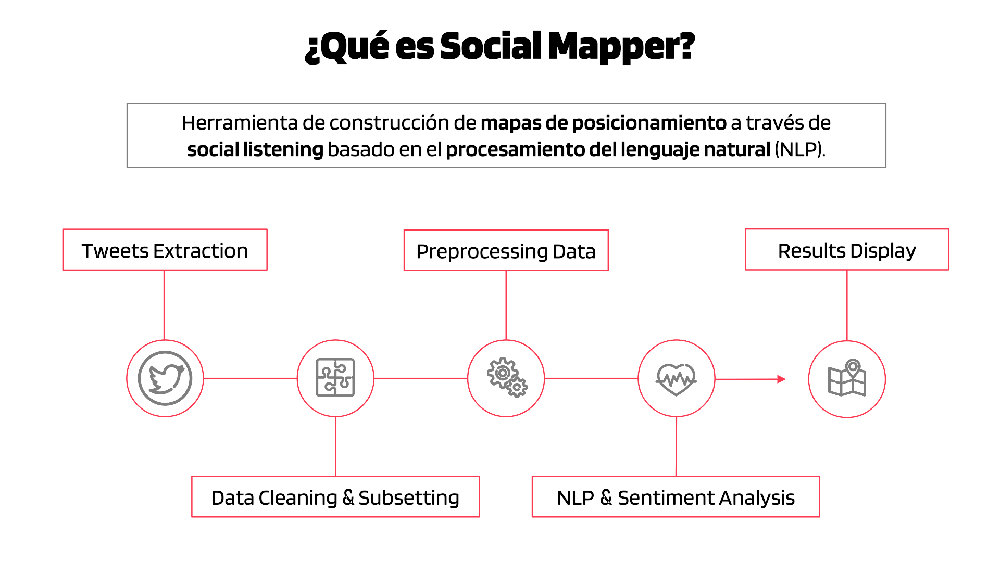

# Social Mapper

[Link a la presentación Power Point online](https://1drv.ms/p/s!AotMQ8QrJclkg6lnUITa_US68WW9HQ?e=5hc0Lm) (presentación de la herramienta y algunos de los resultados obtenidos mediante la misma, con una pequeña explicación de cada diapositiva en notas).

## Contexto

Social Mapper se desarrolla como proyecto final para el Data Analytics Bootcamp de Ironhack.

El proyecto se lleva a cabo durante un periodo de tiempo de 7 días de trabajo. Al contar con tan poco tiempo, el resultado es en realidad un mínimo producto viable de la herramienta, la cual tiene un potencial mucho mayor al que se muestra en esta primera versión.

Social Mapper aborda dos conceptos fundamentales - los mapas de posicionamiento y el *social listening* - para dar solución a una problemática real en la marcas a través del procesamiento del lenguaje natural (NLP).

## Objetivo

Social Mapper nace como un concepto que pretende aportar valor al marketing estratégico a través del análisis de datos.

El objetivo es desarrollar una herramienta de construcción de mapas de posicionamiento a través de​ social listening basado en el procesamiento del lenguaje natural (NLP).

Dadas las limitaciones del proyecto, la meta a alcanzar en esta primera versión de la herramienta es el desarrollo de un prototipo que demuestre que la idea es viable y que puede proporcionar resultados relevantes que aporten valor a la gestión de las marcas y la manera en que actúan en el mercado.

## Etapas Básicas del Proyecto

## Tech Stack

- [Twitter API v2](https://developer.twitter.com/en/docs/twitter-api)

- [Tweepy](https://www.tweepy.org/)
- [Pandas](https://pandas.pydata.org/)
- [Numpy](https://numpy.org/)
- [RegEx](https://docs.python.org/3/library/re.html)
- [Seaborn](https://seaborn.pydata.org/#)
- [Plotly](https://plotly.com/python/)
- [NLTK](https://www.nltk.org/)
- [spaCy](https://spacy.io/)
- [TextBlob](https://textblob.readthedocs.io/en/dev/#)
- [VADER](https://pypi.org/project/vaderSentiment/)

