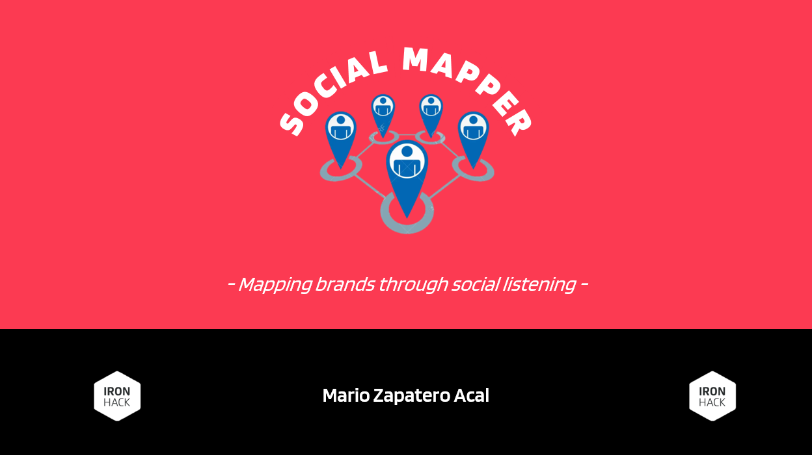

# Social Mapper

[Link a la presentación Power Point online](https://1drv.ms/p/s!AotMQ8QrJclkg6lnUITa_US68WW9HQ?e=5hc0Lm) (presentación de la herramienta y algunos de los resultados obtenidos mediante la misma, con una pequeña explicación de cada diapositiva en **notas**).

Se recomienda su lectura como introducción al proyecto para tener así una visión general del mismo más allá del código que lo compone.

## Contexto

Social Mapper se desarrolla como proyecto final para el Data Analytics Bootcamp de Ironhack.

El proyecto se lleva a cabo durante un periodo de tiempo de 8 días de trabajo. Al contar con tan poco tiempo, el resultado es en realidad un mínimo producto viable de la herramienta, la cual tiene un potencial mucho mayor al que se muestra en esta primera versión.

Social Mapper aborda dos conceptos fundamentales: los **mapas de posicionamiento** y el ***social listening***. La idea es combinar estos dos conceptos de marketing para resolver una problemática real en la gestión estratégica de las marcas, aportando una solución basada en el procesamiento del lenguaje natural (NLP).

## Objetivo

Social Mapper nace como un concepto que pretende aportar valor al marketing estratégico a través del análisis de datos.

El **objetivo** es desarrollar una herramienta que facilite la construcción de mapas de posicionamiento y, para ello, definiremos la posición de cada marca a través de​ *social listening* basado en el procesamiento del lenguaje natural (NLP).

Dadas las limitaciones del proyecto, la meta a alcanzar en esta primera versión de la herramienta es el desarrollo de un prototipo que demuestre que la idea es viable y que puede proporcionar resultados relevantes que aporten valor a la gestión de las marcas y la manera en que actúan en el mercado.

## Workflow

Las etapas básicas del proceso son las siguientes:​

1. *Tweets Extraction:* obtenemos los tweets que mencionan a las marcas analizadas a través de la API de Twitter, gestionando la extracción de datos de manera sencilla gracias a librería Tweepy.​

2. *Data Cleaning & Subsetting:* una vez tenemos los datos, llevamos a cabo una limpieza de los mismos y los dividimos en subsets en función de si el tweet hace referencia a un atributo de marca u otro (calidad, precio, innovación...). En esta primera versión de la herramienta hemos selecciónado los atributos "calidad general" y "precio", que se corresponden en realidad con el nivel más básico en los mapas de posicionamiento.​

3. *Preprocessing Data:* llevamos a cabo un preprocesamiento de los datos para que el modelo funcione correctamente (tokenization, lemmatization, stop words removal...).​

4. *NLP & Sentiment Analysis:* con los datos ya preparados, pasamos a la etapa de NLP como tal. Aquí evaluamos el sentimiento de cada tweet y agrupamos los resultados para obtener métricas globales por marca y atributo. Lo que se pretende es obtener una métrica (cuantitativa) de un aspecto cualitativo como es la percepción del cliente acerca de determinados atributos de marca.​

5. *Results Display:* todo el proceso anterior produce unos resultados que nos permiten graficar el mapa de posicionamiento que estamos buscando. En esta etapa manejamos los resultados y construimos el mapa de posicionamiento para poder transmitirlos de manera visual.​

## Ejemplo de Resultados Obtenidos

## Tech Stack

- [Twitter API v2](https://developer.twitter.com/en/docs/twitter-api)

- [Tweepy](https://www.tweepy.org/)
- [Pandas](https://pandas.pydata.org/)
- [Numpy](https://numpy.org/)
- [RegEx](https://docs.python.org/3/library/re.html)
- [Seaborn](https://seaborn.pydata.org/#)
- [Plotly](https://plotly.com/python/)
- [NLTK](https://www.nltk.org/)
- [spaCy](https://spacy.io/)
- [TextBlob](https://textblob.readthedocs.io/en/dev/#)
- [VADER](https://pypi.org/project/vaderSentiment/)

